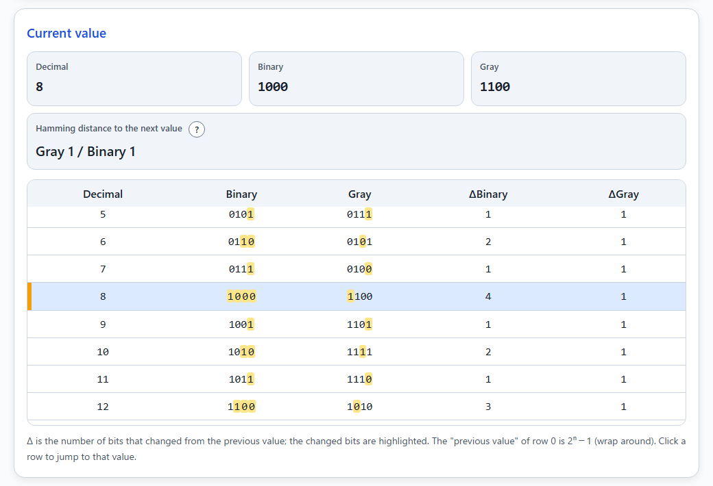
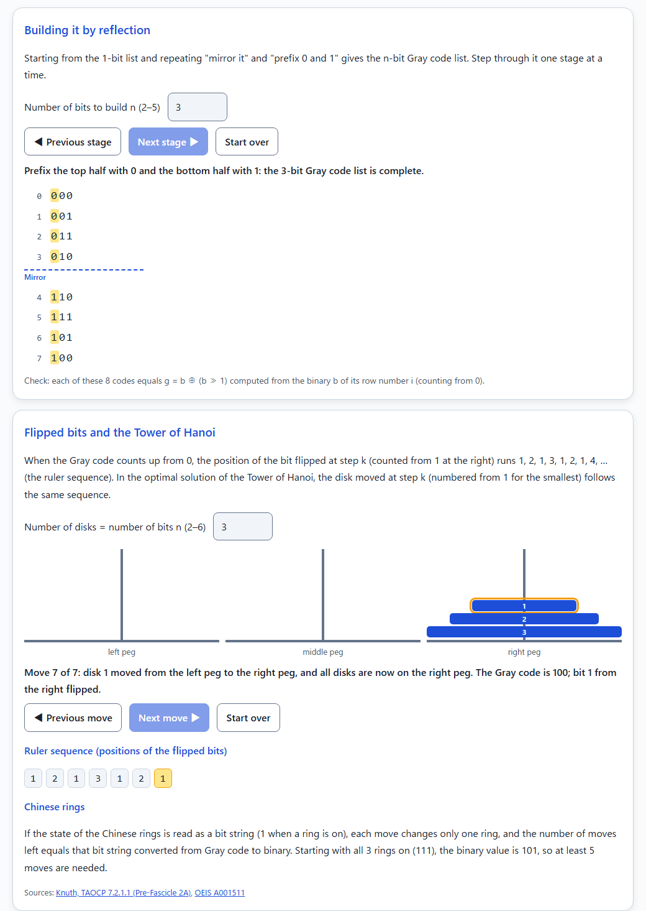
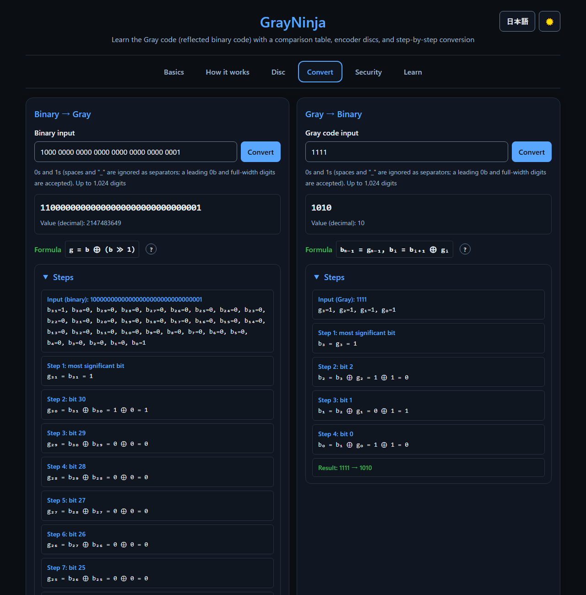
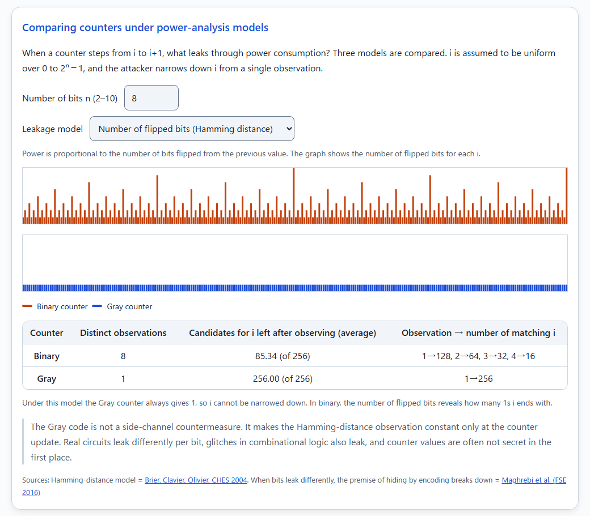

English · [日本語](README.md)


[](https://ipusiron.github.io/GrayNinja/)

**Day066 - 100 Security Tools with Generative AI**

# GrayNinja - Gray Code Encoder Disc Visualization Tool

**GrayNinja** is a tool for learning the Gray code (reflected binary code) through six screens: a comparison table, how it is built, encoder discs, step-by-step conversion, a security comparison, and source-backed notes.

The Gray code is a binary code ordered so that adjacent values always differ in exactly one bit. Two discs (Gray and binary) rotate to the same angle, so you can compare how many rings change at once when a sector boundary is crossed. A misread simulator offsets the sensors of the read head and shows in numbers how far off the binary disc can read.

---

## 🌐 Demo

👉 **[https://ipusiron.github.io/GrayNinja/](https://ipusiron.github.io/GrayNinja/)**

Try it directly in your browser.

---

## 📸 Screenshots

>
>*Sensors offset alternately by 10% of a sector width; just before the 7/8 boundary the binary disc misreads 13*

>
>*The comparison table highlights the bits that changed from the previous value. 7→8 changes 4 bits in binary and 1 bit in Gray*

>
>*The 3-bit list built by reflection and the Tower of Hanoi solved in 7 moves; the disk numbers match the ruler sequence*

>
>*Dark mode: converting a 32-digit binary number to Gray code with the steps shown*

>
>*Comparing what leaks from binary and Gray counters under power-analysis models*

>
>*The Learn tab: history and real uses, each with a source. The second card covers contact bounce in mechanical encoders*

---

## ✨ Features

- Six tabs (Basics, How it works, Disc, Convert, Security, Learn) walk through the properties and uses of the Gray code.
- The How it works tab steps through building the list by reflection, and shows how the positions of the flipped bits (the ruler sequence) match the Tower of Hanoi moves and the number of moves for the Chinese rings.
- The comparison table supports 1 to 12 bits and highlights the changed bits in both binary and Gray.
- Two encoder discs rotate to the same angle, so the sector under the read line can be read in Gray and in binary side by side.
- The misread simulator offsets the sensor of each ring and compares, for Gray and binary, how often a value farther than a neighbor is read over one turn and how large the error gets.
- Conversion accepts up to 1,024 digits and shows digit-by-digit steps for up to 64 digits.
- The Security tab compares counters under three leakage models of power analysis, and computes the flips needed to brute-force switches and the bits sent with a De Bruijn sequence.
- The Learn tab is based on patents, papers, standards, and manufacturer materials, and every card links to its source.
- Japanese/English and light/dark theme switching (your choices are saved automatically).

---

## 📖 How to use

### Basics

1. Choose the number of bits n (1 to 12).
2. Move the value with Next/Prev or the slider. The ← → keys also step, and Space starts or stops auto play.
3. In the table, check how many bits changed from the previous value (ΔBinary, ΔGray) and which ones are highlighted.

Keyboard shortcuts work only while the Basics tab is shown and no button or input has focus.

### How it works

1. In "Building it by reflection", choose the number of bits (2 to 5) and press "Next stage" to apply "mirror it" and "prefix 0 and 1" one stage at a time. The finished list is checked against the formula (g = b ⊕ (b ≫ 1)).
2. In "Flipped bits and the Tower of Hanoi", choose the number of disks (2 to 6) and press "Next move" to step through. The disk moved and the position of the flipped bit in the Gray code line up at the same place in the ruler sequence. The number of moves for the same number of Chinese rings is shown below.

### Disc

1. Move the "Disc position" slider slowly, or press "Next sector".
2. Compare the code of the sector under the read line (the red line) and the value it represents, in Gray and in binary.
3. Press "Rotate" to keep the discs turning at a constant speed.
4. Turn on "Offset the sensor for each ring" to read each ring at its red dot. Change the pattern (alternating, gradually from outside to inside, random) and the size (0 to 150% of a sector width), and compare the misreadings in the summary table and graph for one full turn.

The outer ring is the most significant bit and the inner ring the least significant bit. On the discs, the light color is 0 and the dark color is 1 (the same in both themes).

### Convert

1. Enter a binary or Gray bit string and press "Convert" (Enter also works).
2. Check the result, the value it represents (decimal), and the digit-by-digit steps.

Spaces and "_" are ignored as separators, and a leading `0b` and full-width 0/1 are accepted. Any other character is reported with its position, and the previous result is cleared.

### Security

1. In "Comparing counters under power-analysis models", choose the number of bits (2 to 10) and a leakage model (number of flipped bits, number of 1s in the value, positions of the flipped bits), and compare how many candidates for i remain after one observation, for binary and Gray.
2. In "Order for brute-forcing switches", choose the number of switches (1 to 16) and the order (binary or Gray), then step through the combinations with "Next" to see which switches flip and the running total. The bits needed with a De Bruijn sequence are shown below.

### Learn

Read cards with sources on the history, real uses, connections to security, and common misconceptions.

---

## 📚 Gray code basics

### Construction (reflection)

Take the 1-bit list `0, 1`, append it in reverse order, then prefix the first half with 0 and the second half with 1. This gives the 2-bit list `00, 01, 11, 10`. Repeating the step gives the n-bit list. The second half mirrors the first, hence "reflected binary code".

```text
n=1: 0, 1
n=2: 00, 01, 11, 10
n=3: 000, 001, 011, 010, 110, 111, 101, 100
```

### Conversion formulas

Bit indices run from 0 at the least significant bit to n−1 at the most significant bit.

- Binary→Gray: `g = b ⊕ (b ≫ 1)`. Bit by bit, `gₙ₋₁ = bₙ₋₁` and `gᵢ = bᵢ₊₁ ⊕ bᵢ`.
- Gray→Binary: `bₙ₋₁ = gₙ₋₁`, `bᵢ = bᵢ₊₁ ⊕ gᵢ`. From the top digit down, XOR the binary bit just obtained with the next Gray bit.

For example, binary `1010` becomes Gray `1111`, and Gray `1111` becomes binary `1010`.

```text
Binary→Gray (1010)        Gray→Binary (1111)
g₃ = b₃ = 1               b₃ = g₃ = 1
g₂ = b₃ ⊕ b₂ = 1 ⊕ 0 = 1   b₂ = b₃ ⊕ g₂ = 1 ⊕ 1 = 0
g₁ = b₂ ⊕ b₁ = 0 ⊕ 1 = 1   b₁ = b₂ ⊕ g₁ = 0 ⊕ 1 = 1
g₀ = b₁ ⊕ b₀ = 1 ⊕ 0 = 1   b₀ = b₁ ⊕ g₀ = 1 ⊕ 1 = 0
```

### 4-bit comparison table

Δ is the number of bits that changed from the previous value. The "previous value" of row 0 is 15 (wrap around).

| Decimal | Binary | Gray | ΔBinary | ΔGray |
|---|---|---|---|---|
| 0 | 0000 | 0000 | 4 | 1 |
| 1 | 0001 | 0001 | 1 | 1 |
| 2 | 0010 | 0011 | 2 | 1 |
| 3 | 0011 | 0010 | 1 | 1 |
| 4 | 0100 | 0110 | 3 | 1 |
| 5 | 0101 | 0111 | 1 | 1 |
| 6 | 0110 | 0101 | 2 | 1 |
| 7 | 0111 | 0100 | 1 | 1 |
| 8 | 1000 | 1100 | 4 | 1 |
| 9 | 1001 | 1101 | 1 | 1 |
| 10 | 1010 | 1111 | 2 | 1 |
| 11 | 1011 | 1110 | 1 | 1 |
| 12 | 1100 | 1010 | 3 | 1 |
| 13 | 1101 | 1011 | 1 | 1 |
| 14 | 1110 | 1001 | 2 | 1 |
| 15 | 1111 | 1000 | 1 | 1 |

Going through all 16 values from 0 to 15, the total number of changed bits is 26 in binary and 15 in Gray. In general, for n bits it is 2^(n+1)−n−2 in binary and 2^n−1 in Gray.

### When the sensors are offset

On a 4-bit disc, with the sensors offset alternately by 10% of a sector width (±2.3°) starting from the outer ring, reading one full turn at 4,096 angles gives the following.

| Disc | Correct value | Neighboring value | Farther than a neighbor | Largest error |
|---|---|---|---|---|
| Gray | 89.84% | 10.16% | 0.00% | None |
| Binary | 84.77% | 7.62% | 7.62% | 6 sectors |

Just before the 7/8 boundary the binary disc reads 13 (`1101`). The Gray disc only reads the neighboring value slightly early near a boundary. The Gray code stays within a neighboring value only while every sensor is offset by less than half a sector; with a 60% offset even the Gray disc reads values two sectors away at 7.62% of the angles.

### When a contact bounces (chattering)

A mechanical encoder reads its position through contacts, so a contact bounces as it switches, turning on and off for a few milliseconds (contact bounce, or chattering). The Gray code does not prevent the bounce itself. What it limits is how far off the reading can be while a contact bounces.

- Absolute encoders: only one bit changes at each boundary, so while a contact bounces the reading only alternates between the two values on either side of the boundary. In binary, four bits bounce together at the boundary between 7 and 8, so any of the 16 values from 0000 to 1111 can be read.
- Incremental encoders: the A and B phases form a 2-bit Gray code that changes as 00, 01, 11, 10 (the same order as the comparison table with n=2 on the Basics tab), and the two phases never change at the same time. A counter that counts the edges of both phases counts +1 and −1 alternately while one phase bounces and, as long as it misses no edge, returns to the correct count when the bounce ends.

In both cases, how to treat the value while it flickers is decided separately by debouncing, such as waiting for a set time or requiring several matching reads. The causes of chattering and ways to prevent it with circuits, software, part choice, and repair are covered in the related article "[Sorting out chattering countermeasures](https://akademeia.info/?p=53421)" (in Japanese).

### Comparing under power-analysis models

For an 8-bit counter stepped once, the average number of candidates for i that remain after one observation (i uniform over 0 to 255) is as follows under three leakage models.

| Leakage model | Binary | Gray |
|---|---|---|
| Number of flipped bits (Hamming distance) | 85.34 | 256.00 |
| Number of 1s in the value (Hamming weight) | 50.27 | 50.27 |
| Positions of the flipped bits | 85.34 | 85.34 |

Under the Hamming-distance model nothing can be narrowed down from the Gray counter. But if bits leak differently so that the flipped bit can be identified, the Gray counter leaks as much as the binary counter does under the Hamming-distance model. The Gray code is not a side-channel countermeasure.

### What the Gray code cannot do

- It cannot detect or correct errors. All 2^n patterns of n bits are used, so flipping one bit yields another valid codeword.
- "A single-bit error only gives a neighboring value" does not hold. The true property is that misreading as a neighboring value costs only one bit; flipping the top bit of `0000` gives `1000`, which represents 15.
- It is not a side-channel countermeasure. See "Power analysis and Hamming distance" and "Common misconceptions" in the Learn tab.
- It does not prevent chattering (contact bounce). It only keeps a misreading during the bounce within the values on either side of the boundary.

---

## 🎯 Use cases

Ways of using this tool in particular

- Confirming that adjacent codes always differ by exactly one bit (coding and encoder classes): in the 4-bit Gray code, all 16 adjacent codes have a Hamming distance of 1, while in ordinary binary the change from 7 to 8 flips 4 bits at once, from 0111 to 1000. You can confirm that a rotary encoder does not misread at a boundary because of the Gray code property that neighbors differ by one bit
- Confirming that the number of switch changes in an exhaustive search is smallest in Gray order (measurement and power-analysis classes): trying all 4,096 combinations of 12 switches in Gray order changes only one switch per step, so there are 4,095 changes, while trying them in binary-number order takes 8,178. You can confirm by the counts why Gray order is chosen when you want the fewest changes (machine wear or a power-analysis model)
- Confirming that the position of the bit that flips at each step is the ruler sequence (combinatorics and puzzle classes): following the Gray code in order, the position of the bit that changes at each step is a fixed run, 0, 1, 0, 2, 0, 1, 0, 3, ... (the ruler sequence). It is the same sequence as the discs moved in the Tower of Hanoi and the rings removed in the Chinese rings. You can confirm, by the position of the flip, that puzzles that look separate share the same structure

- Explain the Gray code and Hamming distance in computer science or electronics classes and training, using the table and the moving discs.
- Before using a rotary encoder in an electronics project, see how Gray and binary readings differ at a boundary. The number of values that can be read while a contact bounces (2 to the power of d when d bits change) can also be estimated from the Hamming distance on the Basics tab.
- Support learning about asynchronous FIFOs in FPGAs or the ordering of Karnaugh maps (00, 01, 11, 10).
- Before studying Gray mapping in digital modulation (QAM, PSK), check by hand that neighbors differ in one bit.
- Follow the positions of flipped bits (0, 1, 0, 2, 0, 1, 0, 3, …) in the table and relate them to puzzles such as the Chinese rings and the Tower of Hanoi.
- Use it as an entry point in security lectures to explain the Hamming-distance model of power analysis, or the order for brute-forcing switches (4,095 flips for 12 switches in Gray order versus 8,178 in binary order). For a fixed radio code it also computes that sending 12-bit codes one by one takes 49,152 bits, while a De Bruijn sequence tries every code in 4,107 bits.
- Practice bit operations and XOR in programming by checking results against the steps.

---

## 🔬 Technical notes

- Conversion works on the bit string itself. Because it never converts to a number (a 32-bit integer), inputs of 32 digits with the top bit set neither flip sign nor hang. Decimal values are computed with BigInt.
- The discs have a single angle. The read line is fixed at the top and the disc rotates. The reading is the code of the sector under the read line.
- Each disc is drawn once with runs of equal bits merged into single arcs, cached, and then rotated on every frame. Rotation advances by elapsed time multiplied by speed, so heavy drawing does not change the speed.
- The comparison table is rebuilt only when the number of bits changes; changing the value just moves the marker on the selected row.
- The misread simulator assumes that the sensor of ring k reads the sector at "disc position + offset k" and reads one full turn at 4,096 or more angles. Each reading is classified as correct, neighboring, or farther than a neighbor by its circular distance from the true sector.
- The computational core (conversion, input normalization, steps, the table, and disc readings) lives in `js/gray-core.js` and is tested with `node --test`.

---

## 🔒 Security

- No network access; a CSP limits scripts and styles to files from the same origin (`script-src 'self'`, `style-src 'self'`, `connect-src 'none'`, `object-src 'none'`).
- On-screen text is built with DOM APIs (`textContent`, `createElement`); no HTML is built with `innerHTML`.
- Input is limited to 1,024 digits, and any character other than 0 and 1 is an error.
- Only the language and theme choices are stored in the browser. The tool works even where storage is unavailable.

---

## ⚠️ Notes and limitations

- The table and the discs go up to 12 bits. On a 12-bit disc the inner sectors are very fine and hard to tell apart without zooming.
- The misread simulator covers only the angular offset of each ring's sensor. Sensor response delays, noise, and manufacturing errors of the disc are not modeled.
- The Learn tab stays within what its sources say. See each card's source for details of each field.

---

## 🧪 Tests

Tests cover the core, HTML, CSS, messages, and READMEs.

```bash
npm test
```

The same tests run on GitHub Actions (`.github/workflows/test.yml`).

---

## 🔗 References

- Frank Gray, [US Patent 2,632,058 "Pulse Code Communication"](https://patents.google.com/patent/US2632058A/en) (filed November 13, 1947; granted March 17, 1953)
- D. E. Knuth, [The Art of Computer Programming 7.2.1.1 "Generating all n-tuples" (Pre-Fascicle 2A)](https://www-cs-faculty.stanford.edu/~knuth/fasc2a.ps.gz)
- [OMRON FAQ00941](https://www.ia.omron.com/support/faq/answer/34/faq00941/index.html) (Gray code in rotary encoders)
- E. Agrell et al., [On the optimality of the binary reflected Gray code](https://doi.org/10.1109/TIT.2004.838367), IEEE Trans. Inf. Theory, 2004
- C. E. Cummings, [Simulation and Synthesis Techniques for Asynchronous FIFO Design](https://web.archive.org/web/2020/http://www.sunburst-design.com/papers/CummingsSNUG2002SJ_FIFO1.pdf), SNUG 2002
- Analog Devices, [MT-020 ADC Architectures I: The Flash Converter](https://www.analog.com/media/en/training-seminars/tutorials/MT-020.pdf)
- E. Brier, C. Clavier, F. Olivier, [Correlation Power Analysis with a Leakage Model](https://www.iacr.org/archive/ches2004/31560016/31560016.pdf), CHES 2004
- STMicroelectronics, [RM0008 Reference manual](https://www.st.com/resource/en/reference_manual/rm0008-stm32f101xx-stm32f102xx-stm32f103xx-stm32f105xx-and-stm32f107xx-advanced-armbased-32bit-mcus-stmicroelectronics.pdf) (15.3.12 Encoder interface mode: counting that cancels out bounce on one input)
- Alps Alpine, [EC11E15244G1](https://tech.alpsalpine.com/e/products/detail/EC11E15244G1/) (chattering specification of a mechanical encoder)
- Other sources are linked from each card in the Learn tab.

---

## 📁 Directory structure

```text
GrayNinja/
├── .github/
│   └── workflows/
│       └── test.yml              # GitHub Actions workflow that runs the tests
├── assets/
│   ├── en/
│   │   ├── screenshot-basics.png # English screenshot of the Basics tab
│   │   ├── screenshot-dark.png   # English screenshot of the Convert tab in dark mode
│   │   ├── screenshot-how.png    # English screenshot of the How it works tab
│   │   ├── screenshot-learn.png  # English screenshot of the Learn tab
│   │   ├── screenshot-security.png # English screenshot of the Security tab
│   │   └── screenshot.png        # English screenshot of the Disc tab
│   ├── favicon.svg               # Favicon
│   ├── screenshot-basics.png     # Screenshot of the Basics tab
│   ├── screenshot-dark.png       # Screenshot of the Convert tab in dark mode
│   ├── screenshot-how.png        # Screenshot of the How it works tab
│   ├── screenshot-learn.png      # Screenshot of the Learn tab
│   ├── screenshot-security.png   # Screenshot of the Security tab
│   └── screenshot.png            # Screenshot of the Disc tab
├── js/
│   ├── app.js                    # Screen logic (tabs, table, how it works, discs, conversion, security, notes)
│   ├── gray-core.js              # Core (conversion, input normalization, steps, disc readings)
│   ├── i18n.js                   # Language selection and static text replacement
│   ├── messages.js               # Japanese and English message dictionary
│   ├── theme-init.js             # Applies the theme before rendering
│   └── theme.js                  # Light/dark switching
├── test/
│   ├── core.test.js              # Core tests
│   ├── css.test.js               # CSS tests (variables, contrast, sizes)
│   ├── html.test.js              # HTML tests (CSP, aria, dictionary keys)
│   ├── i18n.test.js              # Language detection tests
│   ├── load.js                   # Helper that loads scripts into tests, plus reference implementations
│   ├── messages.test.js          # Message tests (Japanese/English parity, sources)
│   └── readme.test.js            # README tests
├── .gitignore                    # Git ignore rules
├── .nojekyll                     # Disables Jekyll on GitHub Pages
├── CLAUDE.md                     # Project notes for Claude Code
├── LICENSE                       # MIT License
├── README.en.md                  # This file
├── README.md                     # Japanese README
├── index.html                    # Main HTML
├── package.json                  # Test definition
└── style.css                     # Stylesheet
```

---

## 💻 Requirements

- Works in modern browsers (Chrome, Edge, Firefox, Safari).
- No installation or build. Open `index.html` or serve the folder from a static server.
- Running the tests requires Node.js 18 or later.

---

## 📄 License

MIT License - see [LICENSE](LICENSE) for details.

---

## 🛠 About this tool

This tool was built as part of the "100 Security Tools with Generative AI" project.
In this project, with the help of AI, a variety of security-related tools are built and released over 100 days.

For details on the project and other tools, see the page below.

🔗 [https://akademeia.info/?page_id=42163](https://akademeia.info/?page_id=42163)
