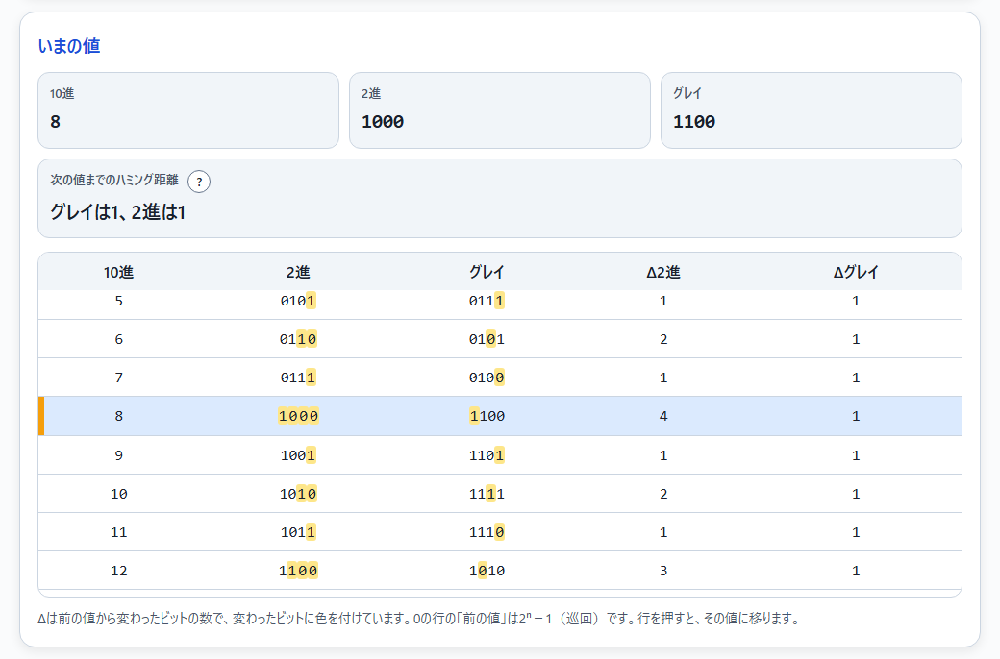
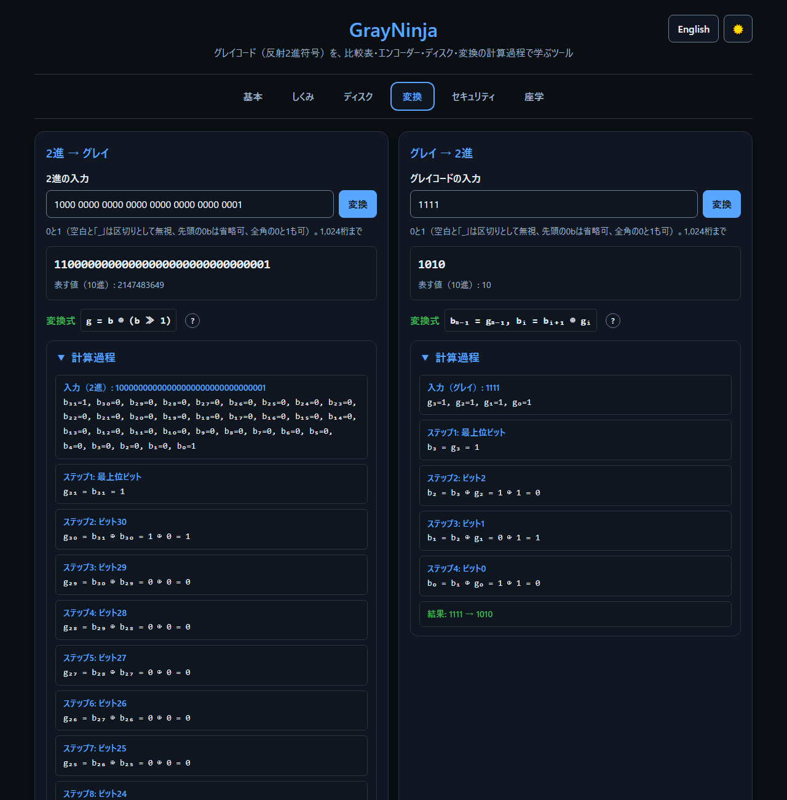

<!--
---
id: day066
slug: GrayNinja

title: "GrayNinja"

subtitle_ja: "グレイコードのエンコーダー・ディスク可視化ツール"
subtitle_en: "Gray Code Encoder Disc Visualization Tool"

description_ja: "グレイコード（反射2進符号）を、比較表・エンコーダー・ディスク・変換の計算過程・座学で学ぶ学習ツール。2枚のディスクで、セクターの境目を越えるときのグレイと2進の違いを見比べられる。"
description_en: "An interactive tool for learning the Gray code (reflected binary code) through a comparison table, encoder discs, step-by-step conversion, and source-backed notes. Two discs show how Gray and binary differ when crossing a sector boundary."

category_ja:
  - データ表現
category_en:
  - Data Representation

difficulty: 2

tags:
  - gray-code
  - binary
  - encoder
  - visualization
  - hamming-distance
  - education

repo_url: "https://github.com/ipusiron/GrayNinja"
demo_url: "https://ipusiron.github.io/GrayNinja/"

hub: true
---
-->

[English](README.en.md) · 日本語


[](https://ipusiron.github.io/GrayNinja/)

**Day066 - 生成AIで作るセキュリティツール100**

# GrayNinja - グレイコードのエンコーダー・ディスク可視化ツール

**GrayNinja**は、グレイコード（反射2進符号）を、比較表・エンコーダー・ディスク・変換の計算過程・座学の4つの画面で学ぶツールです。

グレイコードは、隣り合う値どうしで必ず1ビットだけが変わるように並べた2進の符号です。2枚のディスク（グレイと2進）を同じ角度で回して、セクターの境目を越える瞬間にいくつのリングが同時に変わるかを見比べられます。読み取りヘッドのセンサーをずらす誤読シミュレーターでは、2進がどれだけ遠い値を読み違えるかを数値で確かめられます。

---

## 🌐 デモページ

👉 **[https://ipusiron.github.io/GrayNinja/](https://ipusiron.github.io/GrayNinja/)**

ブラウザーで直接お試しいただけます。

---

## 📸 スクリーンショット

>
>*センサーを交互にセクター幅の10%ずらし、7と8の境目の手前で2進が13と読み違えたところ*

>
>*比較表で、前の値から変わったビットに色が付くところ。7→8は2進で4ビット、グレイで1ビット*

>
>*ダークモードで、32桁の2進をグレイコードに変換し、計算過程を表示したところ*

>
>*座学のタブで、歴史と使われている場面を出典つきで読むところ*

---

## ✨ 特徴

- 基本・ディスク・変換・座学の4つのタブで、グレイコードの性質と使われ方を順に学べます。
- 比較表は1〜12ビットに対応し、前の値から変わったビットを2進とグレイの両方で色分けします。
- 2枚のエンコーダー・ディスクを同じ角度で回し、読み取り線の下のセクターをグレイと2進で読み比べます。
- 誤読シミュレーターでリングごとのセンサーをずらし、一周したときに隣より遠い値を読む割合と最大のずれを、グレイと2進で比べられます。
- 変換は1,024桁まで受け付け、64桁までは1桁ずつの計算過程を表示します。
- 座学のタブは、特許・論文・規格・メーカーの資料に当たった内容で、各カードに出典のリンクがあります。
- 日本語・英語の切り替え、ライト・ダークのテーマ切り替えに対応します（選択は自動で保存されます）。

---

## 📖 使い方

### 基本

1. ビット数n（1〜12）を決めます。
2. 「次へ」「前へ」かスライダーで値を動かします。キーボードの← →でも動き、Spaceで自動再生を始めたり止めたりできます。
3. 比較表で、前の値から変わったビットの数（Δ2進・Δグレイ）と、変わった位置の色を確かめます。

キーボードの操作は、基本のタブを表示していて、ボタンや入力欄にフォーカスがないときだけ働きます。

### ディスク

1. 「ディスクの位置」のスライダーをゆっくり動かすか、「次のセクター」を押します。
2. 読み取り線（赤い線）の下にあるセクターの符号と、それが表す値を、グレイと2進で見比べます。
3. 「回転」を押すと、ディスクが一定の速さで回り続けます。
4. 「リングごとのセンサーをずらす」をオンにすると、各リングを赤い点の位置で読みます。ずらし方（交互・外側から内側へ少しずつ・ランダム）と大きさ（セクター幅の0〜150%）を変え、一周の集計表とグラフで読み違いを比べます。

外側のリングが最上位ビット、内側が最下位ビットです。ディスクの色は、明るい色が0、濃い色が1です（テーマによらず同じ）。

### 変換

1. 2進かグレイコードのビット列を入れて「変換」を押します（Enterでも変換できます）。
2. 結果、表す値（10進）、1桁ずつの計算過程を確かめます。

空白と「_」は区切りとして無視し、先頭の`0b`と全角の0・1も受け付けます。それ以外の文字があると、何文字目の何という文字かをエラーで知らせ、前の結果は残しません。

### 座学

歴史、使われている場面、セキュリティとの接点、よくある誤解を、出典つきのカードで読みます。

---

## 📚 グレイコードの基礎

### 作り方（反射）

1ビットの列`0, 1`を逆順にして後ろに付け、前半の先頭に0、後半の先頭に1を付けると、2ビットの列`00, 01, 11, 10`ができます。これをくり返すとnビットの列になります。後半が前半の鏡写しになるので「反射2進符号」と呼びます。

```text
n=1: 0, 1
n=2: 00, 01, 11, 10
n=3: 000, 001, 011, 010, 110, 111, 101, 100
```

### 変換の式

ビットの添字は最下位を0、最上位をn−1とします。

- 2進→グレイ: `g = b ⊕ (b ≫ 1)`。ビットごとに書くと`gₙ₋₁ = bₙ₋₁`、`gᵢ = bᵢ₊₁ ⊕ bᵢ`です。
- グレイ→2進: `bₙ₋₁ = gₙ₋₁`、`bᵢ = bᵢ₊₁ ⊕ gᵢ`。上の桁から順に、直前に求めた2進のビットとグレイのビットのXORを取ります。

例として、2進`1010`はグレイ`1111`に、グレイ`1111`は2進`1010`になります。

```text
2進→グレイ（1010）       グレイ→2進（1111）
g₃ = b₃ = 1               b₃ = g₃ = 1
g₂ = b₃ ⊕ b₂ = 1 ⊕ 0 = 1   b₂ = b₃ ⊕ g₂ = 1 ⊕ 1 = 0
g₁ = b₂ ⊕ b₁ = 0 ⊕ 1 = 1   b₁ = b₂ ⊕ g₁ = 0 ⊕ 1 = 1
g₀ = b₁ ⊕ b₀ = 1 ⊕ 0 = 1   b₀ = b₁ ⊕ g₀ = 1 ⊕ 1 = 0
```

### 4ビットの比較表

Δは前の値から変わったビットの数です。0の行の「前の値」は15（巡回）です。

| 10進 | 2進 | グレイ | Δ2進 | Δグレイ |
|---|---|---|---|---|
| 0 | 0000 | 0000 | 4 | 1 |
| 1 | 0001 | 0001 | 1 | 1 |
| 2 | 0010 | 0011 | 2 | 1 |
| 3 | 0011 | 0010 | 1 | 1 |
| 4 | 0100 | 0110 | 3 | 1 |
| 5 | 0101 | 0111 | 1 | 1 |
| 6 | 0110 | 0101 | 2 | 1 |
| 7 | 0111 | 0100 | 1 | 1 |
| 8 | 1000 | 1100 | 4 | 1 |
| 9 | 1001 | 1101 | 1 | 1 |
| 10 | 1010 | 1111 | 2 | 1 |
| 11 | 1011 | 1110 | 1 | 1 |
| 12 | 1100 | 1010 | 3 | 1 |
| 13 | 1101 | 1011 | 1 | 1 |
| 14 | 1110 | 1001 | 2 | 1 |
| 15 | 1111 | 1000 | 1 | 1 |

全16通りを0から15まで順に巡ると、変わるビットの合計は2進で26、グレイで15です。一般にnビットでは、2進が2^(n+1)−n−2、グレイが2^n−1になります。

### センサーがずれたとき

4ビットのディスクで、外側のリングから順にセンサーを交互にセクター幅の10%（±2.3°）ずらし、一周を4,096か所の角度で読むと次のようになります。

| ディスク | 正しい値 | 隣の値 | 隣より遠い値 | 最大のずれ |
|---|---|---|---|---|
| グレイ | 89.84% | 10.16% | 0.00% | なし |
| 2進 | 84.77% | 7.62% | 7.62% | 6セクター |

2進は7と8の境目の手前で13を読みます（`1101`）。グレイは境目の近くで隣の値を少し早く読むだけです。グレイが隣の値までで済むのは、どのセンサーのずれも半セクター未満のときで、60%ずらすとグレイでも7.62%の角度で2つ離れた値を読みます。

### グレイコードにできないこと

- 誤りの検出・訂正はできません。nビットの2^n通りをすべて使うので、1ビットが反転すると別の正しい符号語になります。
- 「1ビットの誤りなら隣の値にしかならない」は成り立ちません。正しい性質は「隣の値への読み違いが1ビットで済む」で、`0000`の最上位ビットが反転した`1000`は値15を表します。
- サイドチャネル攻撃の対策にはなりません。詳しくは座学のタブの「電力解析とハミング距離」と「よくある誤解」を参照してください。

---

## 🎯 活用例

- 情報系・電気電子系の授業や研修で、グレイコードとハミング距離を、表とディスクの動きで説明する。
- 電子工作でロータリーエンコーダーを使う前に、境目でグレイと2進の読み取り方がどう違うかを確かめる。
- FPGAの非同期FIFOや、カルノー図の並び（00, 01, 11, 10）を学ぶときの補助にする。
- デジタル変調のグレイ配置（QAM・PSK）を学ぶ前に、隣が1ビット違いという性質を手で確かめる。
- チャイニーズリングやハノイの塔のようなパズルと、反転するビットの位置（0, 1, 0, 2, 0, 1, 0, 3, …）の関係を、比較表で追う。
- セキュリティの講義で、電力解析のハミング距離モデルや、スイッチの総当たりの順番（グレイ順なら12個で切り替え4,095回、2進順なら8,178回）を説明する入口にする。
- プログラミングの練習で、ビット演算やXORの結果を、計算過程と突き合わせて確かめる。

---

## 🔬 技術的な説明

- 変換はビット列を文字列のまま行います。数値（32ビットの整数）に直さないので、32桁で最上位が1の入力でも符号が反転したり、処理が終わらなくなったりしません。10進の値はBigIntで計算します。
- ディスクの角度は1つだけで、読み取り線は真上に固定し、ディスクのほうを回します。読み取り値は、読み取り線の下にあるセクターの符号です。
- ディスクは、同じビットが続く区間を1つの弧にまとめて描いた絵をキャッシュし、回すたびにその絵を回転して描き直します。回転は経過時間に速さを掛けて進めるので、描画の重さで速さが変わりません。
- 比較表はビット数を変えたときだけ作り直し、値を変えたときは選んだ行の印を付け替えるだけにしています。
- 誤読シミュレーターは、リングkのセンサーが「ディスクの位置＋ずれk」の角度のセクターを読むとして、一周を4,096か所以上の角度で読みます。正しいセクターとの円周上の距離で、正しい値・隣の値・隣より遠い値に分けます。
- 計算部（変換・入力の正規化・計算過程・比較表・ディスクの読み取り）を`js/gray-core.js`に分け、`node --test`で検証しています。

---

## 🔒 セキュリティ

- 外部との通信をせず、スクリプト・スタイルを同じ場所のファイルだけに限るCSPを設定しています（`script-src 'self'`・`style-src 'self'`・`connect-src 'none'`・`object-src 'none'`）。
- 画面の文字はDOMのAPI（`textContent`・`createElement`）で組み立て、`innerHTML`でHTMLを作りません。
- 入力は1,024桁までに制限し、0と1以外の文字はエラーにします。
- ブラウザーに保存するのは、言語とテーマの選択だけです。保存できない環境でも動きます。

---

## ⚠️ 注意と限界

- 比較表とディスクは12ビットまでです。12ビットのディスクは内側のリングのセクターが細かく、拡大しないと見分けにくくなります。
- 誤読シミュレーターが扱うのは、リングごとのセンサーの角度のずれだけです。センサーの応答の遅れ、ノイズ、ディスクの製造誤差は扱いません。
- 座学のタブの内容は出典の範囲で書いています。応用分野の詳細は、各カードの出典を参照してください。

---

## 🧪 テスト

計算部・HTML・CSS・文言・READMEをまとめて検証します。

```bash
npm test
```

GitHub Actions（`.github/workflows/test.yml`）でも同じテストを実行します。

---

## 🔗 参考文献

- Frank Gray, [US Patent 2,632,058 "Pulse Code Communication"](https://patents.google.com/patent/US2632058A/en)（1947年11月13日出願、1953年3月17日登録）
- D. E. Knuth, [The Art of Computer Programming 7.2.1.1 "Generating all n-tuples"（Pre-Fascicle 2A）](https://www-cs-faculty.stanford.edu/~knuth/fasc2a.ps.gz)
- [オムロンFAQ00941](https://www.ia.omron.com/support/faq/answer/34/faq00941/index.html)（ロータリーエンコーダーのグレイコード）
- E. Agrell et al., [On the optimality of the binary reflected Gray code](https://doi.org/10.1109/TIT.2004.838367), IEEE Trans. Inf. Theory, 2004
- C. E. Cummings, [Simulation and Synthesis Techniques for Asynchronous FIFO Design](https://web.archive.org/web/2020/http://www.sunburst-design.com/papers/CummingsSNUG2002SJ_FIFO1.pdf), SNUG 2002
- Analog Devices, [MT-020 ADC Architectures I: The Flash Converter](https://www.analog.com/media/en/training-seminars/tutorials/MT-020.pdf)
- E. Brier, C. Clavier, F. Olivier, [Correlation Power Analysis with a Leakage Model](https://www.iacr.org/archive/ches2004/31560016/31560016.pdf), CHES 2004
- そのほかの出典は、座学のタブの各カードにあります。

---

## 📁 ディレクトリー構造

```text
GrayNinja/
├── .github/
│   └── workflows/
│       └── test.yml              # テストを実行するGitHub Actions
├── assets/
│   ├── en/
│   │   ├── screenshot-basics.png # 英語・基本のタブのスクリーンショット
│   │   ├── screenshot-dark.png   # 英語・ダークモードの変換のタブのスクリーンショット
│   │   ├── screenshot-learn.png  # 英語・座学のタブのスクリーンショット
│   │   └── screenshot.png        # 英語・ディスクのタブのスクリーンショット
│   ├── favicon.svg               # ファビコン
│   ├── screenshot-basics.png     # 基本のタブのスクリーンショット
│   ├── screenshot-dark.png       # ダークモードの変換のタブのスクリーンショット
│   ├── screenshot-learn.png      # 座学のタブのスクリーンショット
│   └── screenshot.png            # ディスクのタブのスクリーンショット
├── js/
│   ├── app.js                    # 画面の処理（タブ・比較表・ディスク・変換・座学）
│   ├── gray-core.js              # 計算部（変換・入力の正規化・計算過程・ディスクの読み取り）
│   ├── i18n.js                   # 言語の選択と静的な文言の差し替え
│   ├── messages.js               # 日本語・英語の文言の辞書
│   ├── theme-init.js             # 描画前にテーマを当てる
│   └── theme.js                  # ライト・ダークの切り替え
├── test/
│   ├── core.test.js              # 計算部の検査
│   ├── css.test.js               # CSS（変数・コントラスト・大きさ）の検査
│   ├── html.test.js              # HTML（CSP・aria・辞書との一致）の検査
│   ├── i18n.test.js              # 言語の判定の検査
│   ├── load.js                   # テストにスクリプトを読み込む補助と参照実装
│   ├── messages.test.js          # 文言（日英の一致・出典）の検査
│   └── readme.test.js            # READMEの検査
├── .gitignore                    # Gitの除外設定
├── .nojekyll                     # GitHub PagesでJekyllを無効化
├── CLAUDE.md                     # Claude Code向けのプロジェクト設定
├── LICENSE                       # MITライセンス
├── README.en.md                  # 英語版README
├── README.md                     # このファイル
├── index.html                    # メインのHTML
├── package.json                  # テストの定義
└── style.css                     # スタイルシート
```

---

## 💻 動作環境

- モダンなブラウザー（Chrome・Edge・Firefox・Safari）で動きます。
- インストールやビルドは不要です。`index.html`を開くか、静的サーバーで配信してください。
- テストの実行にはNode.js 18以上が必要です。

---

## 📄 ライセンス

MIT License - 詳細は[LICENSE](LICENSE)を参照してください。

---

## 🛠 このツールについて

本ツールは、「生成AIで作るセキュリティツール100」プロジェクトの一環として開発されました。
このプロジェクトでは、AIの支援を活用しながら、セキュリティに関連するさまざまなツールを100日間にわたり制作・公開していく取り組みを行っています。

プロジェクトの詳細や他のツールについては、以下のページをご覧ください。

🔗 [https://akademeia.info/?page_id=42163](https://akademeia.info/?page_id=42163)
